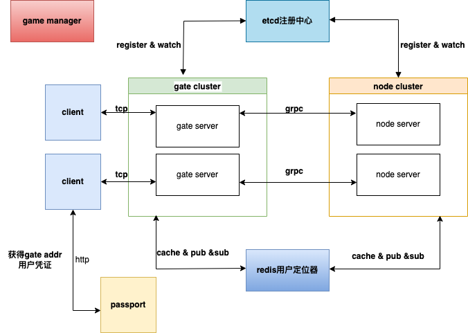

# loric

[](https://opensource.org/licenses/MIT)


### 1.介绍

loric 是一款基于golang的分布式游戏服务器框架 （目前处于研发中)




### 2.功能

- 网关：tcp协议的网关服务器
- 节点通信：grpc
- 日志：基于zap
- 服务发现注册：支持etcd
- 协议：支持protobuf、json
- 配置: 基于viper
- 游戏常用技术(见gkit):异步操作 、定时任务及守护任务 、延迟保存、时间轮
- 集成服务权重，通过设置权重，达到流量控制，另一层面实现热更新效果。
- gm管理系统


### 3.安装项目和依赖工具
```shell
go get github.com/cr-mao/loric@v0.0.0
# protobuf 编译
go install google.golang.org/protobuf/cmd/protoc-gen-go@v1.28
# grpc通信
go install google.golang.org/grpc/cmd/protoc-gen-go-grpc@v1.2

# https://github.com/protocolbuffers/protobuf/releases/tag/v23.4
```

### 4.tcp协议

```text
-------------------------------
| len | seq | route | message |
-------------------------------
```
说明：

1. 使用tcp协议时，为了解决粘包问题，还应在包前面加上包长度len，固定为4字节，使用大端序编码
2. seq表示请求序列号     4字节，常用于请求、响应对的确认。
3. route表示消息路由    2字节，不同的路由对应不同的业务处理流程。
4. message表示消息体，采用json或protobuf编码。
5. **心跳包** 包长度len，固定为4字节， 包长度固定为0。


### 框架相关文档

[框架相关文档](doc/README.md)


### 参考

- [due](https://github.com/dobyte/due)
- [zinx](https://github.com/aceld/zinx)
- [kratos](https://github.com/go-kratos/kratos)
- [goim](https://github.com/Terry-Mao/goim)
- [iam极客时间go语言项目实战](https://github.com/marmotedu/iam)


